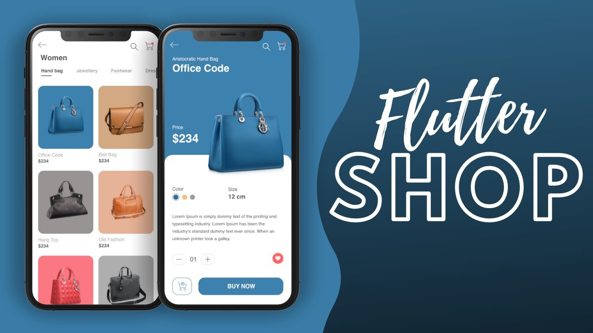

# mycatalog

Esta sera una app de catalogos de producto, donde el usuario podra ver una variedad de produdctos
y guardar dicho productos en una lista de favoritos.

Esta app surge para la entrega del poryecto final del Diplomado avanzado de flutter de la UAPA con el maestro
Maikel Aparicio Reytor

## Paquetes o dependecias usada en el app

- http: ^0.12.2
- sqflite: ^1.3.0

## API REST

https://fakestoreapi.com/

## Integrantes del equipo

- Dayern Gomez
- Rainny Martinez Chavez
- Oscary Ramírez De Oleo

## Estructura de carpetas

- config : en esta se declara variables para guardar de forma gobla ciertas configuracion como el url del api.
- data : en esta estara todo realcionado a la base de datos.
- models: es esta se estableceran los modelos.
- pages: en esta se estableceran las paginas del app.
- services: en esta se establceran los metodos o servicios que se usaran.
- widgets: se esatableceran los widtes que se podran reutilizar.

## Ramas

Se trabajara en dos ramas una master y una de desarrollo.

## Menejos de issues y progreso de trabajo.

Se creo project donde se estableceran los issues por hacer y asi tener un tracking de lo que se esta trabajando.

# To do : issues que se deben hacer.

# Progress : issues que se esta trabajando.

# Complete : issues completados.

- Se creara issues basico al inicar el proyecto.
- Cada integrante puede ir creado issue nuevo a la medida que vaya avanzado.
- La asignacion de los issues lo puedes hacer cada integrante de forma individual.

favor de ir a la pestaña de [project](https://github.com/neryad/mycatalog/projects/1)

## UI de guia para el app

Esta sera la ui guia y base a seguir para realziar el proyecto.

